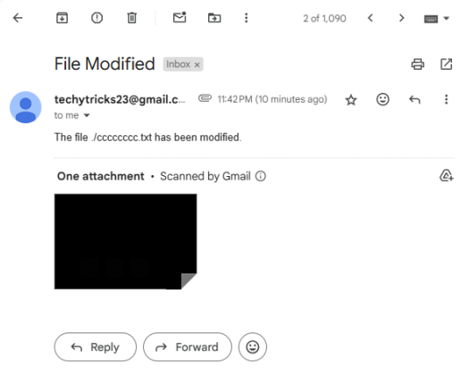
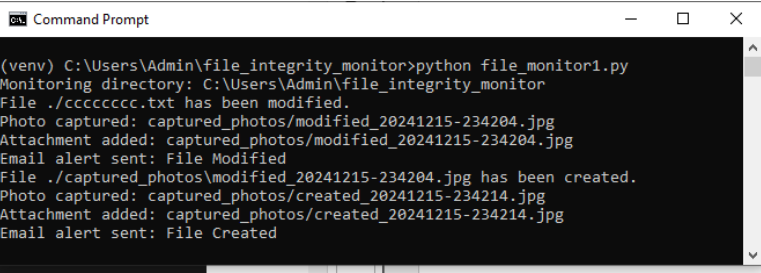

# 🔐 Advanced File Integrity Monitoring System (FIM)
## 🔍 Real-World Relevance

File Integrity Monitoring is used in cybersecurity to detect unauthorized changes in critical system files, which may indicate malware activity or security breaches.

This project simulates a basic FIM system used in enterprise security tools.


## 📌 Overview

This project is an advanced File Integrity Monitoring (FIM) system designed to detect unauthorized file changes in real-time using SHA-256 hashing, with enhanced features like photo evidence capture and automated email alerts.

## 🎯 Objective

* Monitor file changes (create, modify, delete)
* Capture photo evidence during file activity
* Send real-time email alerts
* Improve security with visual verification

## 🚀 Features

* Real-time file monitoring using Watchdog
* SHA-256 hash-based integrity verification
* SQLite database for storing file hashes
* Automated email alerts with attachments
* Webcam-based photo capture for evidence
* Lightweight and efficient system design

## 🧠 System Architecture

The system consists of:

* File Monitoring Module (Watchdog)
* Hashing Module (SHA-256)
* Database Module (SQLite)
* Alert Module (Email Notifications)
* Evidence Module (Webcam Capture)

## 🛠️ Technologies Used

* Python 3
* Watchdog
* Hashlib
* SQLite3
* OpenCV
* SMTP (Email)

## ⚙️ How It Works

1. Monitor a directory using Watchdog
2. Generate hash values for files
3. Store hashes in SQLite database
4. Detect file changes via hash comparison
5. Capture image using webcam on change
6. Send email alert with evidence

## ▶️ How to Run

```bash
pip install -r requirements.txt
python main.py
```

## 📷 Key Features from Project

* Real-time monitoring of file changes
* Photo capture on file modification
* Email alerts with attachments
* Low resource usage and easy deployment
* 
## 📸 Output Example




## 📌 Use Cases

* Detect unauthorized file access
* Monitor critical system files
* Support forensic investigations
* Improve system accountability

## 🔮 Future Improvements

* Integration with SIEM tools
* Real-time dashboard for monitoring
* Advanced anomaly detection using AI

## 👨‍💻 Author

Gundeti Venkata Sai Sri Charan
